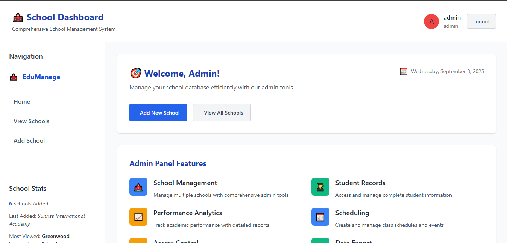
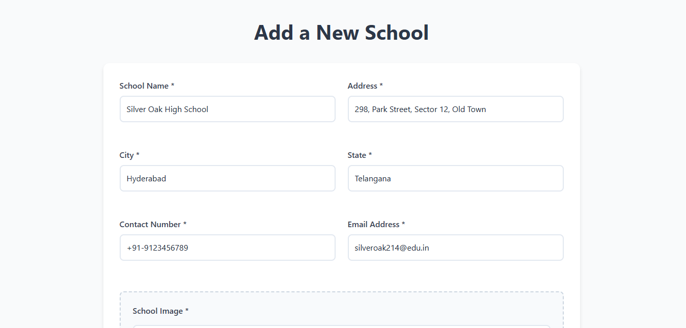
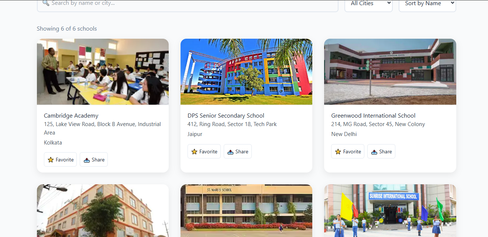

# 🏫 School Directory App

A **comprehensive school management system** built with **Next.js, React, TypeScript, and MySQL**.  
This application provides an **admin dashboard** for managing school information with **authentication, role-based access, CRUD operations, and analytics visualization**.


---

## Live Demo

- **Live App:** [School Directory App](https://school-directory-app-gamma.vercel.app/)  
- **GitHub Repo:** [kajal7392/school-directory-app](https://github.com/kajal7392/school-directory-app.git)

---

## Table of Contents

- [Features](#-features)
- [Tech Stack](#️-tech-stack)
- [Installation](#️-installation)
- [Environment Variables](#-environment-variables)
- [Database Setup](#️-database-setup)
- [Usage](#-usage)
- [API Endpoints](#-api-endpoints)
- [Deployment](#-deployment)
- [Contributing](#-contributing)
- [License](#-license)
- [Support](#-support)
- [Acknowledgments](#-acknowledgments)

---

## Features

- **Authentication** – Secure login/logout with JWT  
- **Admin Dashboard** – Manage schools, view analytics, role-based access  
- **School Management** – Add, update, and list school information  
- **Data Visualization** – Dashboard with real-time statistics  
- **Responsive UI** – Optimized for desktop and mobile devices  
- **Image Uploads** – School logos and photos supported  
- **Optimized Performance** – Built with **Next.js 15.5.2** for speed  

### Screenshots

**Authentication**  


**Dashboard View**  


**Add School**  


**View Schools**  


---

## Tech Stack

**Frontend**
- Next.js 15.5.2  
- React 18.2.0  
- TypeScript 5.0  
- CSS Modules & Custom CSS  

**Backend**
- Next.js API Routes  
- MySQL 8.0  
- JWT Authentication  
- bcryptjs for password hashing  

**Deployment**
- Vercel (Frontend + API Routes)  
- Railway / PlanetScale (Database)  

**Development**
- ESLint (Code Linting)  
- TypeScript (Type Safety)  

---

<<<<<<< HEAD
## 📁 Project Structure

SCHOOL-DIRECTORY-APP
├─ public/
│ ├─ schoolImages/ # Uploaded school images
│ └─ avatars/ # User/Admin avatars
├─ src/
│ ├─ app/
│ │ ├─ addSchool/ # Add School Page
│ │ ├─ showSchools/ # School Listing Page
│ │ ├─ login/ # Authentication Page
│ │ ├─ api/ # Next.js API Routes
│ │ │ ├─ add-school/
│ │ │ ├─ get-schools/
│ │ │ └─ auth/ # Login, Logout, Me
│ │ ├─ globals.css
│ │ └─ layout.tsx
│ ├─ components/
│ │ └─ ProtectedRoute.tsx
│ ├─ context/
│ │ └─ AuthContext.tsx
│ ├─ lib/
│ │ ├─ db.ts # MySQL connection
│ │ ├─ auth.ts
│ │ └─ avatar.ts
│ └─ types/
│ └─ database.ts
├─ schema.sql # Database schema
├─ admin.sql # Optional: Admin seed
├─ next.config.ts
├─ package.json
├─ tsconfig.json
└─ README.md

yaml
Copy code

---
=======
>>>>>>> 5791c76 (Update README.md)

## ⚙️ Installation

Clone repository:

```bash
git clone https://github.com/kajal7392/school-directory-app.git
cd school-directory-app
```

Install dependencies:

```bash
npm install
```

Run development server:

```bash
npm run dev
```

---

## Environment Variables

Create a `.env.local` file in the root:

```env
DATABASE_HOST=localhost
DATABASE_USER=root
DATABASE_PASSWORD=your_password
DATABASE_NAME=school_directory
JWT_SECRET=your_jwt_secret
NEXT_PUBLIC_BASE_URL=http://localhost:3000
```

---

## Database Setup

Create the database:

```sql
CREATE DATABASE school_directory;
```

Import schema:

```bash
mysql -u username -p school_directory < schema.sql
```

Example tables:

```sql
CREATE TABLE schools (
  id INT AUTO_INCREMENT PRIMARY KEY,
  name VARCHAR(255) NOT NULL,
  address TEXT,
  city VARCHAR(100),
  state VARCHAR(100),
  contact VARCHAR(20),
  image VARCHAR(255),
  email_id VARCHAR(255),
  created_at TIMESTAMP DEFAULT CURRENT_TIMESTAMP
);

CREATE TABLE users (
  id INT AUTO_INCREMENT PRIMARY KEY,
  username VARCHAR(50) UNIQUE NOT NULL,
  email VARCHAR(100) UNIQUE NOT NULL,
  password_hash VARCHAR(255) NOT NULL,
  role ENUM('admin', 'user') DEFAULT 'user',
  avatar VARCHAR(255),
  created_at TIMESTAMP DEFAULT CURRENT_TIMESTAMP
);
```

---

## Usage

Visit: [http://localhost:3000](http://localhost:3000)

Login with default admin credentials:

```
Username: admin
Password: admin123
```

Navigate the dashboard → Add/View schools → Check stats → Logout securely when finished.

---

## API Endpoints

### Auth
- `POST /api/auth/login` – User login  
- `POST /api/auth/logout` – User logout  
- `GET /api/auth/me` – Current user  

### Schools
- `GET /api/get-schools` – Fetch all schools  
- `POST /api/add-school` – Add new school  
- `GET /api/school-stats` – Statistics  

### Utility
- `GET /api/health` – Health check  
- `GET /api/test-connection` – DB test  

---

## 🚀 Deployment

### Vercel
1. Push code to GitHub  
2. Connect repo to Vercel  
3. Add environment variables in Vercel dashboard  
4. Deploy automatically  

### Manual
```bash
npm run build
npm start
```

---

## Contributing

1. Fork the repo  
2. Create feature branch → `git checkout -b feature/AmazingFeature`  
3. Commit changes → `git commit -m 'Add AmazingFeature'`  
4. Push branch → `git push origin feature/AmazingFeature`  
5. Open Pull Request  

---

## 📄 License

Licensed under the **MIT License**.  
See [LICENSE](LICENSE) for details.

---

## Support

<<<<<<< HEAD
For questions or issues, open a GitHub Issue:  
[School Directory App Issues](https://github.com/kajal7392/school-directory-app/issues)

---

## Acknowledgments

- Next.js team for the amazing framework  
- Vercel for seamless deployment  
- MySQL for reliable database management  
=======
MySQL for reliable database management
>>>>>>> 1d66028 (Update README.md)
